# 疾管署 AI-ready 新官網原型

**一句話：內容與資料只存一份（`content/`），網頁、API、機讀版、AI 檢索索引與治理儀表板都是它的「消費者」，由 `npm run build` 一次算出來。**

- 線上網址：<https://ancientsky.github.io/new_cdc_prototype/>
- 對應規劃文件：《疾管署官網 AI 應用與資料治理導入：盤點、規格與路線圖》（2026-09-22）與 11 頁 wireframe
- 狀態：**原型**。架構與規則是真實結構，疫情數字、通函、核准紀錄等為示意資料（見下方〈資料來源與示意聲明〉）

| 首頁（流感高峰 → 情境式首屏） | 答案頁（每句附來源編號） |
| --- | --- |
| 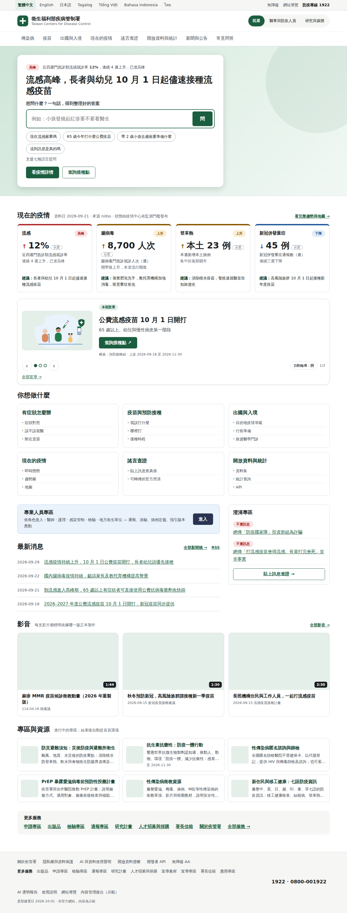 | 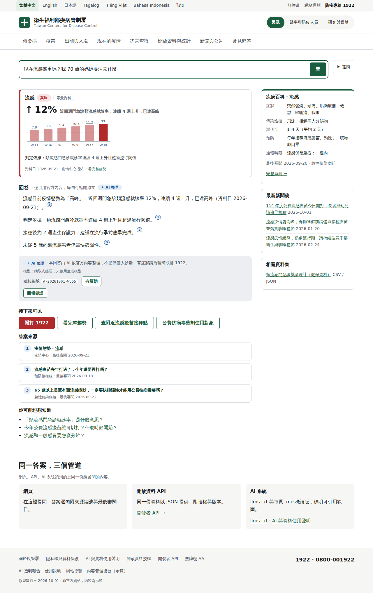 |

| 疾病頁（八區塊＋一分鐘重點＋三層露出） | 失效版文件（自動警示、noindex、版本鏈） |
| --- | --- |
| 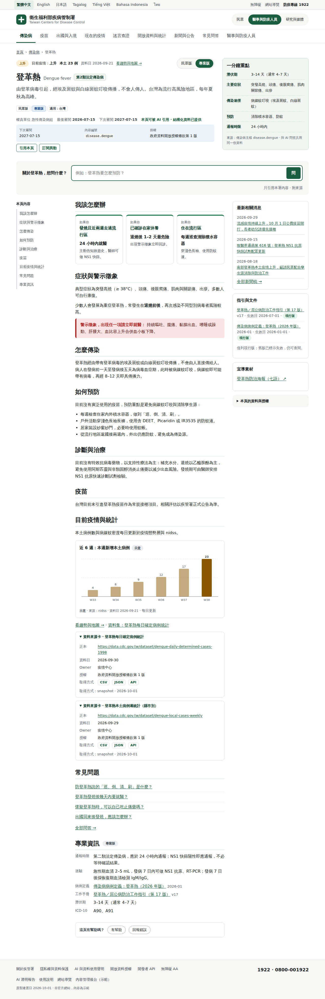 | 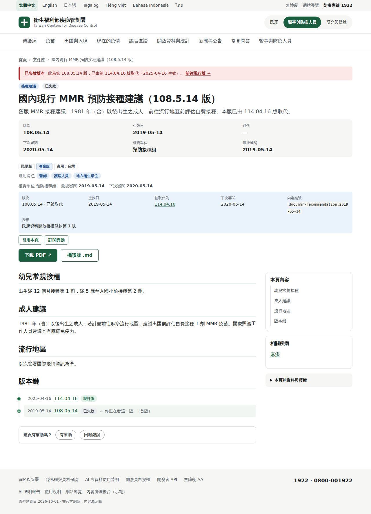 |

| 專業人員專區 | 後台：連動待辦（MMR 事件自動產生） |
| --- | --- |
| 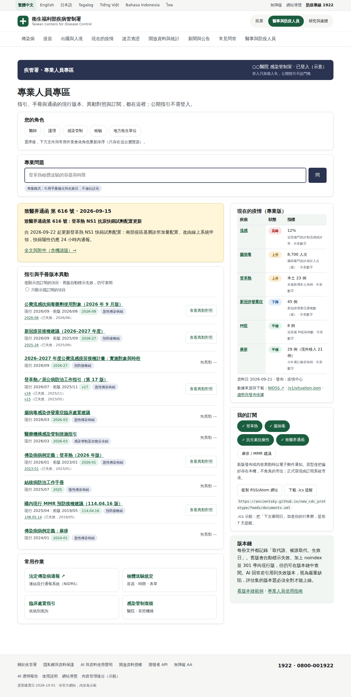 | 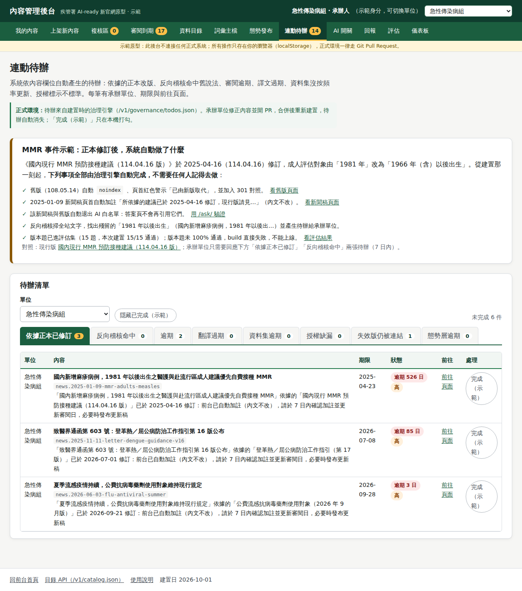 |

| 影音頁：過時影片自動加註（MMR 事件） | 通報專區：時限表由主檔自動產生 |
| --- | --- |
| 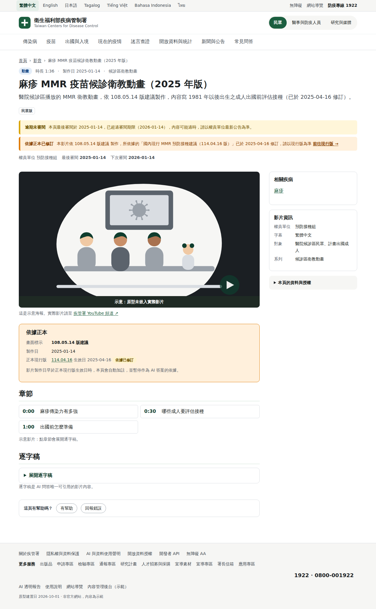 | 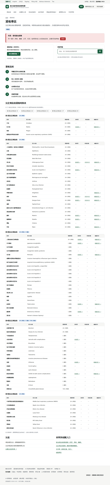 |

| 關於疾管署：組織圖自主檔產生 | 宣導專區：Banner 有權責與上下架 |
| --- | --- |
| 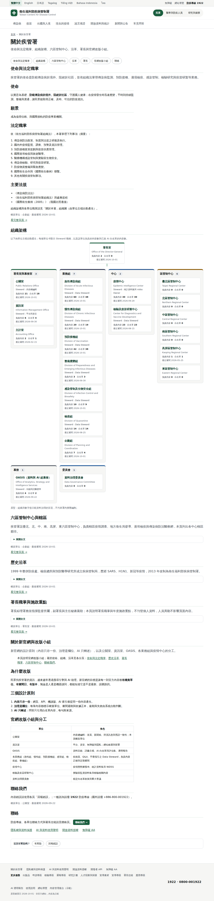 | 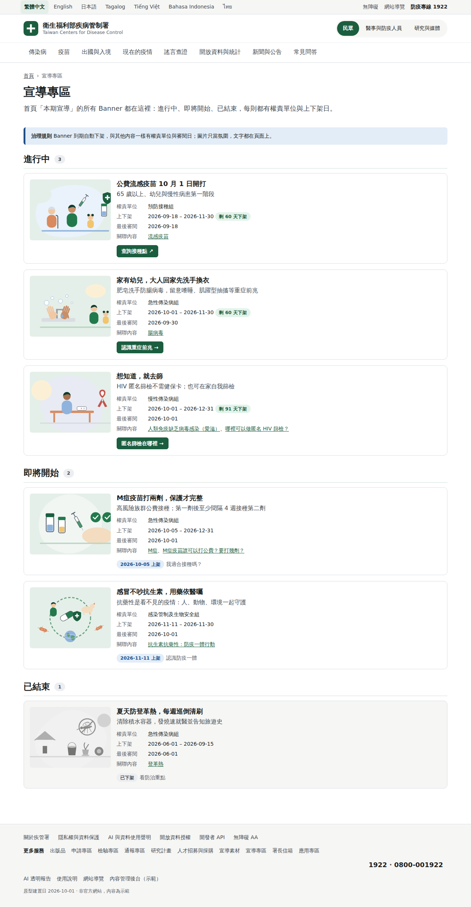 |

更多：[治理儀表板](docs/screenshots/admin.png)、[手機首頁](docs/screenshots/home-mobile.png)、[越南文首頁](docs/screenshots/home-vi.png)。

## 這個原型示範什麼

1. **治理是欄位，不是另一個系統。** 每筆內容必填權責單位、最後審閱日、審閱週期、對象、狀態、授權。缺一個，建置失敗，上不了線。
2. **人只填一次，機器算其餘。** 下次審閱日、逾期、失效版本、衍生內容待辦、AI 白名單資格、翻譯是否過期、KPI、季報，全部由欄位在建置時推導。
3. **AI 只轉述、不創作。** 預設答案引擎是「抽取式」：每句話就是白名單內容的一句原文並附來源編號；可選接 LLM（自備金鑰），輸出每句必須對得到檢索片段，對不上就刪。

## 規模與功能清單

- **規模**：內容 300 筆（疾病、疫苗、FAQ、新聞與公告、文件、澄清、資料集、影音、專區、申請服務、出版品、檢驗項目、研究計畫、職缺、標案）；七語靜態頁 2,605 頁（含 231 個目的地頁）；後台 18 頁；評估集 195 題（版本題 19）；治理測試 357 項。
- **內容型別（16 種）**：疾病、Q&A、新聞稿／通函／澄清、文件（版本鏈）、疫苗、資料集、Banner、一般頁，加上第二輪新增的**影音、專區、申請服務、出版品、檢驗項目、研究計畫**，以及第七輪獨立出的**人才招募（`job`）、採購公告（`tender`）**。
- **民眾端**：一句話提問、六任務、疫情態勢、疾病與疫苗、旅遊、謠言查證、影音庫、專區、申請專區、公告、署長信箱。
- **專業端**：版本異動對照、檢驗專區、通報專區（時限表自動產生）、研究計畫、出版品、訂閱。
- **後台**：上架預處理（十五種型別，含發布車道徽章、排程與緊急發布、模擬送出）、複核、審閱到期、資料目錄（含影音、專區、申請、出版品、檢驗、研究）、**公告管理、影音管理、外部連結健康**、連動待辦（含影音過時、無逐字稿、連結失效、檢驗不一致）、疫情發布、AI 開關、評估、儀表板。
- **出國與入境（第四輪）**：以目的地為主：231 個國家／地區各有目的地頁（針對性等級、持續時間、長期建議標籤、旅程三階段建議由疾病主檔規則生成、該國近 30 天疫情資訊）；`/travel/` 依序為查目的地、近 30 天變化、世界地圖（三級三色、點國家進頁）、全球背景提醒、針對性等級表；API 新增 `/v1/country-changes.json`、`/v1/country-background.json`。
- **新增的自動化**：公告截止自動標示並退出首頁；影片製作日早於正本現行版生效日自動標過時；逐字稿參與反向稽核；外部連結每日 `npm run fetch -- --check-links` 檢查，失效自動變待辦；通報時限表由主檔產生。

## 第五輪：舊網址不 404，結核病專區移轉示範

舊網站的內容不會因為改版而不見，舊網址也不該變成 404。第五輪用**結核病專區**走完一整套「舊頁 → 新頁」的流程，做法可以套到其他 98 種疾病與所有欄目：

- **移轉清單**：`content/migration/tuberculosis.json` 逐筆列出舊頁（標題、舊網址、類型）、處理方式（已移轉／已併入／已封存／待確認／已移除）、對應的新內容與段落。權責單位在後台 `/admin/migration/` 逐筆確認（`verified`）；舊網址 ID 取不到者以 `{id}` 佔位，確認時補上。
- **新擺法、新要求**：結核病疾病頁加上專區導覽（民眾／專業各一套），指引與手冊走文件版本鏈，另有 Q&A、專區、補助與潛伏結核感染治療服務；頁首治理列有「本頁取代舊網站 N 個頁面」，展開看每筆舊網址與移轉後新增的治理要求。
- **舊網址不 404**：建置自動輸出 `v1/redirects.json`、`v1/legacy-map.json`，以及三種伺服器轉址檔 `redirects/nginx.map`、`redirects/web.config.rewritemap.xml`、`redirects/_redirects`；404 頁自動帶往新頁，`/legacy/` 可貼舊網址查新頁。靜態主機的 404 頁只是示範與備援，**正式站必須由伺服器回 301**。
- **上線後監測**：`node scripts/analyze-404-log.mjs access.log --map dist/v1/legacy-map.json --migration content/migration` 把 404 log 分成「可直接 301」「待補對照」「真的不存在（建議 410）」三類，待補對照附可貼進清單的草稿。
- **規劃回補**：整理了 39 項「規劃文件沒寫到、原型做了」的作法，見 [docs/plan-supplement.md](docs/plan-supplement.md)（第 29–39 項為後四輪新增）；完整移轉與轉址手冊見 [docs/migration-playbook.md](docs/migration-playbook.md)；同事操作步驟見 [docs/guide-staff.md](docs/guide-staff.md) 第 15 節。

> 限制：開發環境連不到 `www.cdc.gov.tw`，結核病專區的舊頁清單依規劃文件的 URL 模式重建，每筆標 `verified: false`，等權責單位確認。

## 第六輪：移轉套用到全部疾病、國際合作區塊、內容來源語言

第五輪證明「一個專區走完整套」可行；第六輪回答「99 種疾病怎麼辦」，並補上舊站只有英文版的國際合作區塊：

- **移轉套用全部疾病（推導清單 → 只寫例外）**：舊站每個疾病頁的子頁結構相同，所以標準子頁樹寫成一份模板 `content/migration/_disease-template.json`，治理引擎對主檔**每一種疾病**推導一份移轉清單（原型主檔 72 種：16 種已有疾病頁，其餘標 `no-page`）；有疾病頁且新站有對應內容就算已移轉／已併入，沒有就是待移轉。人工清單**只寫模板沒有的例外**（疾病特有專區頁、專屬指引與公告），同 `key` 覆蓋推導結果。待辦每份清單只開一則，優先度依法定類別。結核病之外，登革熱、流感、麻疹、腸病毒也回補了防治計畫（`professional.programs`）、文件、Q&A 與例外清單。後台 `/admin/migration/` 看 72 份清單進度，`/v1/migration/{slug}.json` 可下載當人工清單的起點。
- **國際合作區塊**：舊英文站的 International Cooperation 移到新站（IHR 國家聯絡窗口、多邊與雙邊合作、國際訓練與申請、英文出版品與新聞），入口為 `/international/`，主選單不增項，放在研究與媒體入口與頁尾。
- **內容來源語言 `sourceLang`**：國際合作內容以**英文為來源語言**、中文為必備的審核譯文：頂層欄位是英文，中文放 `i18n['zh-TW']`；缺中文譯文建置失敗；頁首標示「本頁以英文為準，中文為譯文」。逾期、譯文過期、白名單等治理規則照常運作。
- **規劃回補與手冊**：[docs/plan-supplement.md](docs/plan-supplement.md) 新增第 29–31 項（推導清單、sourceLang、國際合作雙語）；[docs/governance-model.md](docs/governance-model.md) 新增規則 17、18；[docs/migration-playbook.md](docs/migration-playbook.md) 新增第 10 節「規模化：99 種疾病怎麼做」；[docs/guide-staff.md](docs/guide-staff.md) 第 15 節改為「推導清單 → 只寫例外」流程。

> 限制：推導清單的舊網址一律以 `{id}` 佔位（標 `pattern`），不進伺服器轉址檔；要讓 301 真的生效，需向資訊室取得舊站 ID 對照（見 playbook 第 10.5 節）。英文站 `/En` 同樣連不到，國際合作的舊頁清單依既有認識重建，全部 `verified: false`。

## 第七輪：人才招募與採購公告分家、招募生命週期、模擬報名

第二輪把人才招募與採購公告放在新聞稿底下，只有一個截止日。第七輪把兩者拆開，各有權責單位與自己的生命週期：

- **人才招募與採購公告分家**：人才招募成為獨立的 `job` 型別（`/careers/`，權責**人事室**，新單位 `unit.personnel`），採購公告成為 `tender` 型別（`/procurement/`，權責秘書室）。`news` 不再有招募與採購兩種；舊 `/news/{slug}/` 網址 301 到新路徑。頁尾「更多服務」也拆成「人才招募」「採購公告」兩個入口。
- **招募生命週期（日期推導，不靠人記）**：即將開放 → 報名中 → 已截止 → 審查與甄試中 → 結果公布 → 90 天後進歷史；人工只有「取消」「已補實」兩種覆蓋。職缺頁有**時間軸**標示目前階段，已截止頁寫明「結果預計 {日期} 公布」。三個待辦：結果逾期、備取將到期、外部報名網址失效。備取名單過有效期後自動不顯示。
- **模擬報名「不送出任何資料」**：`/careers/{slug}/apply/` 是三步驟的示範表單（即時驗證、草稿、收執可列印、可下載 JSON 與 `.ics`），**資料只存在你的瀏覽器 localStorage，不送出任何資料**，頁面明示為原型示範。正式站的報名系統在站外或後端（職缺填 `applyUrl`），本站只公布職缺、時程與結果。
- **個資遮罩閘門**：甄選結果與遞補公告只公布**報名編號與遮罩姓名**；`nameMasked` 必須含遮罩字（○）且不得有完整姓名樣式、`candidateNo` 不得像身分證字號、正取數不得超過名額，**違反即建置失敗**。AI 白名單排除名單，答案引擎問「誰錄取」只給結果頁連結。
- **採購公告狀態化**：招標中 → 已截止 → 已開標 → 已決標（或流標、取消），決標逾期自動開待辦；本站只做入口與狀態，**正式公告以政府電子採購網為準**。
- **文件**：[docs/careers-privacy.md](docs/careers-privacy.md)（招募個資處理原則）；[docs/guide-staff.md](docs/guide-staff.md) 新增第 16 節（人才招募 SOP，人事室）與第 17 節（採購公告 SOP，秘書室）；[docs/governance-model.md](docs/governance-model.md) 新增規則 19–21；[docs/plan-supplement.md](docs/plan-supplement.md) 新增第 32–34 項；[docs/migration-playbook.md](docs/migration-playbook.md) 新增 10.8「欄目型清單：人才招募、採購」。
- **輸出**：`/v1/jobs.json`、`/v1/tenders.json`（含階段）、RSS `feeds/careers.xml`、`feeds/procurement.xml`、JSON-LD `JobPosting`；後台 `/admin/jobs/`（人事室：職缺與階段、待辦、結果上架檢核）、`/admin/tenders/`（秘書室）。

> 限制：連不到 `www.cdc.gov.tw`，舊站「人才招募」「採購公告」欄目的移轉清單（`content/migration/careers.json`、`procurement.json`）依既有認識重建，全部 `verified: false`。示範資料中的職缺、錄取名單（報名編號與遮罩姓名）與決標廠商皆為虛構，不可當作真實公告引用。

## 第八輪：上架功能補完：所見即所得編輯、附件與圖片的放法

前幾輪的上架流程要同事「貼 Markdown、手寫附件網址」。第八輪補上兩個缺口：不會 Markdown 的人怎麼寫內文，以及附件與內文圖片放哪裡、建置時檢查什麼。**正本仍是 Markdown＋JSON**（可 diff、可機讀、可給 AI），所見即所得只是輸入方式。

- **三頁籤內文編輯**：`/admin/publish/` 內文欄有**所見即所得／Markdown／預覽**三個頁籤，同一份資料、即時轉換；工具列有標題、粗斜體、清單、連結、表格、圖片、引用；貼上 Word 或網頁內容時自動清成支援的子集。**存檔一律是 Markdown**。
- **附件與圖片面板**：拖放多檔；檔名自動正規化（中文檔名要自己改）、選 `kind`（附件／內文圖片／資料檔）、填 label 與 alt、授權與來源、PDF 是否有文字層、算 SHA-256；一鍵把圖片插進內文。
- **上架包**：「產生上架包」下載 **ZIP**（內含 `content/{型別}/{id}.json` 與 `content/assets/{id}/…` 原檔），畫面列出放哪裡與 PR 指引；解壓到 repo、開 PR、CI 檢查即可。
- **檔案放哪裡**：`content/assets/{內容 id}/` → 公開網址 `/files/{內容 id}/{檔名}`（七語共用，不帶語言前綴）；內容用 `assets[]` 宣告每個檔。檔名只能小寫英數、連字號、底線與點。
- **建置閘門**：檔案存在、`sha256`／`bytes` 相符、格式與大小在限制內（PDF ≤ 20 MB、圖片 ≤ 2 MB、資料檔 ≤ 50 MB）、SVG 無腳本、內文 `/files/` 引用都有宣告；**圖片沒有 alt 或授權直接建置失敗**；孤兒檔開待辦。hash 不符時訊息印出實際值，`npm run build -- --fix-assets` 可自動補寫 `bytes`／`sha256`／`mime`／寬高。
- **PDF 可及性**：PDF 沒有文字層又沒附 `.md`／`.docx` 替代版 ⇒ 待辦 `attachment-no-accessible-version`。
- **文件**：[docs/assets-policy.md](docs/assets-policy.md)（新）；[docs/guide-staff.md](docs/guide-staff.md) 第 2 節重寫為完整上架 SOP（三種編輯方式、附件與圖片、上架包、常見錯誤）；[docs/governance-model.md](docs/governance-model.md) 新增規則 22–24 與共同欄位 `assets`；[docs/plan-supplement.md](docs/plan-supplement.md) 新增第 35–36 項；ARCHITECTURE §16。

> 限制：原型的建置檢查不做**病毒掃描**與**個資偵測**，PDF 文字層只有簡易偵測（宣告 `machineReadable: true` 卻偵測不到時警告；標籤與閱讀順序無法判斷，`machineReadable` 是承辦人聲明，由複核者抽查）；這些列為正式站待辦，見 [docs/assets-policy.md](docs/assets-policy.md) 第 10 節。範例檔案皆為本輪由 `scripts/gen-sample-assets.mjs` 產生的示意檔。

## 第九輪：發布車道與自動合併、預覽網址、預定與緊急發布、舊站匯出批次轉換

目標：承辦人感受到的流程**跟舊後台一樣簡單**（登入 → 選型別 → 填標題 → 貼內文 → 拖附件 → 送出，一樣 6 步），治理在背後自動發生；並示範舊站匯出一鍵轉成內容草稿。原型沒有後端，所以後台的「送出」是**模擬**（產生上架包 → 開 PR 的時間軸展示），**但 PR 之後的一切在 GitHub Actions 上真的會跑**。

- **三條發布車道**（`content/governance/lanes.json`，由系統依型別判定）：**快車道**（新聞稿、通函、澄清、職缺、採購、Banner）CI 通過就自動合併，約 3 分鐘上線，公關室 24 小時內複核；**一般車道**（疾病、疫苗、文件、Q&A、專區…）CI 通過還要 1 位審核人核准（疾病與疫苗為公關室＋OASIS），SLA 2 個工作天；**緊急發布**（疫情態勢，以及標了 `urgent` 的新聞稿／通函／澄清）10 分鐘內上線。一個 PR 含多種內容時取最嚴格的車道。**CI 是第一位審核者**；多語不擋中文。
- **後台 `/admin/publish/`**：型別一選就顯示**車道徽章**與一句說明；新增「**排程發布**」（`publishAt`，臺北時間）與「**緊急發布**」（`urgent`，只對新聞稿／通函／澄清顯示）；預檢加「urgent 只能用於允許型別」「`publishAt` 必須晚於現在」；預處理結果最下面「**模擬送出**」展開時間軸：建立分支 → 開 PR → CI 檢查（schema、治理規則、評估集、檔案資產、連結）→ 車道判定 → 自動合併／等待審核（列審核人與 SLA）→ 部署 → 預覽網址，每步附「正式環境由系統代做」。模擬送出**不呼叫任何 API**。

  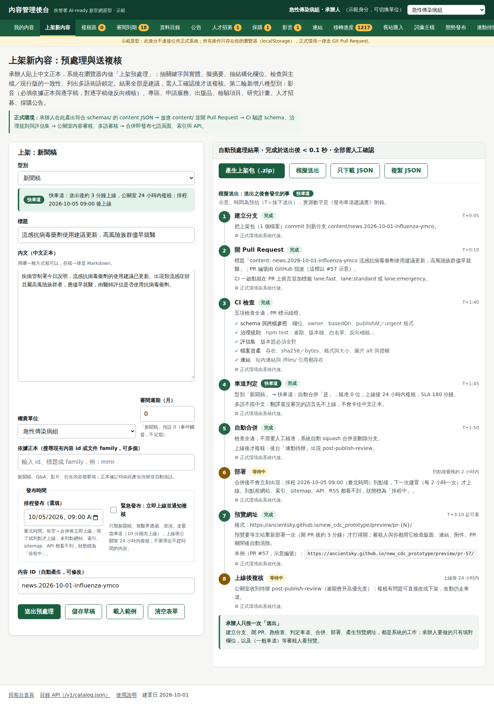

- **PR 預覽網址**：每個 PR 有專屬預覽 `https://ancientsky.github.io/new_cdc_prototype/preview/pr-{N}/`（`previews` 分支，主站部署時複製進 `dist/preview/`），PR 關閉自動清除。**預覽目錄在 GitHub Pages 上是公開的**，只能示範，正式環境必須放內網或加存取控制。
- **排程發布與上線後複核**：`publishAt` 未到點的內容不渲染、不進索引、sitemap、API、RSS、`llms.txt`（以真實時間判斷，不受 `BUILD_TODAY` 影響）；主站改為**每 2 小時重建**，到點後最晚 2 小時內上線。快車道與緊急發布的內容上線後，治理引擎自動開 `post-publish-review` 待辦（公關室，24 小時內，逾期升為高優先）。
- **工作流程**：`content-pr.yml`（檢查、車道判定、預覽、PR 留言與標籤、自動合併）、`preview-cleanup.yml`、`lane-sla.yml`（逾期加 `sla:breach`）、`pages.yml`（每 2 小時）；`.github/CODEOWNERS` 以註解標示單位對應。`node scripts/lane.mjs <變更檔案…>` 可在本機試車道判定。
- **舊站匯出批次轉換**：`node scripts/import-legacy.mjs <匯出目錄> --out <輸出目錄>` 讀舊站匯出（每頁 `.html`＋`.json` 側檔），依規則檔 `content/migration/import/_import-rules.json` 轉成內容**草稿**（`status: review`、信心 0–1、問題清單）、搬附件並宣告 `assets`、輸出批次報告與移轉清單更新建議；信心 < 0.6 一定人工檢視；後台 `/admin/import/` 看報告。第一批實測是結核病 40 個舊頁（**模擬匯出**，整合者補實測數字）。
- **文件**：[docs/publishing-lanes.md](docs/publishing-lanes.md)（**建議書**，給主管與各單位：問題、原則、車道表、時程、預覽、預定與緊急、複核、權限、SLA、試行計畫、按鍵數對照、風險）；[docs/legacy-import.md](docs/legacy-import.md)（匯出格式、規則檔、信心分級、三級處理、結核病首批）；[docs/guide-staff.md](docs/guide-staff.md) 第 2.8、2.9 節與第 15.14 節；[docs/governance-model.md](docs/governance-model.md) 新增規則 25–27 與欄位 `publishAt`、`urgent`、`postPublishReview`、`conversion`；[docs/plan-supplement.md](docs/plan-supplement.md) 新增第 37–39 項；[docs/deploy.md](docs/deploy.md) 補工作流程與注意事項；ARCHITECTURE §17。

> 限制：(1) 後台的「送出」是**展示**，原型不能代承辦人開 PR，交件仍是下載 ZIP；(2) GitHub 工作流程**無法在本機驗證**，是否如預期運作以開一個真實測試 PR 的結果為準（見 [docs/publishing-lanes.md](docs/publishing-lanes.md) 附錄 B）；(3) 排程發布受每 2 小時重建限制，延遲最多 2 小時；(4) 開發環境連不到舊站，結核病首批用的是**依既有內容反推的模擬匯出**，真實匯出的版型與品質可能不同，規則要用真實樣本校準。

## 第十八輪：後台登入怎麼設計、權責單位點得進去

起因：同事問「假如要設計後台維護登入，要怎麼設計比較好？」以及「每頁的權責組室能不能點一下連回他們的介紹網頁？」這輪

- **後台登入**：建議**接機關 SSO（OIDC）＋雙因子，不另設帳號密碼**；單位與角色由 AD 群組帶入（`CDC-WEB-<unit>-<role>`），每個動作綁個人並留稽核。三種做法（自建帳密／機關 SSO／Git 平台帳號）的比較與為什麼選 SSO，見 [docs/admin-auth.md](docs/admin-auth.md)。原型新增 `/admin/login/`：沒登入進任何後台頁都會被導過去，選一個示範帳號（姓名遮罩）等於模擬 IdP 回傳身分；登入後右上顯示姓名、單位、角色與登出鈕。
- **角色×單位，規則只有一份**：承辦人、複核者、疫情發布、內容總編輯、治理幕僚、平台管理六種角色；複核區、疫情發布、AI 開關、評估四頁限角色，其他頁任何同事可進但只看自己單位；只有總編輯、OASIS、資訊室能切換單位視角。進不去會看到「不在你的角色權限內」並寫稽核。規則在 `src/client/admin/auth-rules.js`（純函式，瀏覽器與測試共用），登入頁的對照表、前端閘門、測試都讀同一份。
- **權責單位可點**：全站每個「權責單位」改成連結，連到新的單位介紹頁 `/about/units/{slug}/`（24 個單位、中英文、`.md` 機讀版）：簡介、主要業務、該單位在本站維護的全部內容（建置時由 `owner` 自動算）、聯絡。簡介為原型撰寫、標「尚待該單位確認」；現行官網的介紹頁網址開發環境無法確認，先留空待補。契約 ARCHITECTURE.md §21。

> 限制：原型沒有後端，登入與稽核只存在瀏覽器；正式環境由閘道回 302／403、集中式稽核。

## 第十七輪：開發者入口不再先看到「國際合作」、首頁「更多服務」去重、頁尾改成分組的 fat footer

起因：同事截圖指出三件事——開發者入口一打開是「國際合作」的進入按鈕（第六輪放的導引卡，但放在 API 說明頁首很突兀）；首頁底部有「更多服務」區塊，和頁尾的服務清單是同一組連結，看起來像重覆；以及「現在還流行 fat footer 嗎」。這輪

- **開發者入口**拿掉「國際合作」導引卡。該卡原意是給外國 API 使用者找英文入口，但放在頁首會讓人以為走錯頁；國際合作已在主選單與頁尾「關於與政策」欄，不必再在這裡擋路。
- **首頁「更多服務」區塊移除**。原本首頁最底部一塊「更多服務」卡片列 + 頁尾又一排同名連結，兩處同一組內容。改成只留頁尾一份，首頁回到「疫情 → 問答 → 熱門主題 → 新聞」的主線，少捲一屏。
- **頁尾改成四欄分組的 fat footer**：服務（出版品、申請、檢驗、通報、招募、採購、宣導…）、關於與政策（關於疾管署、國際合作、隱私、AI 聲明、無障礙、使用說明、網站導覽）、開放資料與開發者（開放資料、API、授權、AI 透明報告、後台示範）、聯絡（1922／0800-001922 防疫專線大字、署長信箱、通報專區）。平板兩欄、手機一欄堆疊。
- **為什麼 fat footer 還是對的**：政府與機構網站（gov.uk、數位發展部、各部會）至今都用分組式頁尾——它是使用者捲到底時的「第二導覽」，也是搜尋引擎與輔助科技讀站點結構的地方。過時的不是 fat footer 本身，而是「把所有連結丟成一長排」的做法；分組、每欄有標題（`<nav aria-labelledby>`）、聯絡資訊獨立一欄，才是現在的做法。首頁不再另做「更多服務」區，正是因為頁尾已經承擔這個角色。
- 多語：四個欄標題與專線說明補齊七語（`footer.group.*`、`footer.hotline.note`）。契約 ARCHITECTURE.md §20。

## 第十六輪：人才招募與採購公告終於能在後台上架、改期、取消、公布結果

起因：人才招募（job）與採購公告（tender）第七輪分成獨立型別後，`/admin/publish/` 不提供它們，`/admin/jobs/`、`/admin/tenders/` 只是唯讀總覽，承辦人要上架得手寫 JSON。這輪

- **兩個上架與異動表單** `/admin/jobs/edit/`（人事室）與 `/admin/tenders/edit/`（秘書室），照「疫情發布」的模式：表單 → 即時預覽與檢核 → 匯出 JSON → 開 PR（快車道，CI 過自動合併）。選既有職缺／標案就帶入全部欄位，四個區塊：公告內容、時程異動（延長截止、改甄試日／開標日）、取消（停止甄選、流標、廢標）、結果公告（錄取名單：正取、備取、遞補；決標：得標廠商、金額）。
- **公告異動紀錄 `amendments[]`**（兩個 schema 都加）：改日期不是改完就算，表單會追加一筆「哪天、改了什麼、一句話說明、字號」，前台詳情頁有「公告異動」區、列表卡標「有異動」，`.md` 機讀版同步。民眾與廠商看得到歷程，承辦人不必另發更正新聞稿。
- **規則只寫一份**：甄選結果個資檢核（遮罩姓名、報名編號）與階段推導從建置腳本抽到 `src/client/careers-rules.js`，後台表單在瀏覽器即時用同一份函式檢核，CI 建置也用它；表單說「可上架」就一定過得了 CI。
- 首頁疫情卡示範資料四筆統一回「標準」樣版（樣版功能保留，疫情中心要換再在表單選）。
- 文件：docs/guide-staff.md §16.10、§17.6（表單操作與「原本 → 改成 → 為什麼」）；契約 ARCHITECTURE.md §19。

## 第十五輪：「疫情發布」改名、首頁疫情卡四種樣版

- 後台「態勢發布」全站改稱**「疫情發布」**（選單、頁名、SOP、RSS 說明）；檔案與網址不變。
- 首頁「現在的疫情」卡可選**四種樣版**：標準、趨勢圖（近週趨勢線）、行動優先（建議放最大）、精簡（一行指標）。樣版是 `situation/current.json` 每筆的 `cardStyle` 欄位，疫情中心在疫情發布表單勾選、即時預覽、可並排比較，隨發布 PR 一起進版，不必改程式。契約見 ARCHITECTURE.md §2.2，操作見 docs/guide-staff.md §4。

## 第十四輪：疫苗接種時程地圖、「幾歲能打哪些公費疫苗」

起因：問答對「65 歲以上可以打哪些公費疫苗」只答到一種疫苗，因為沒有一份按年齡排好全部疫苗的資料。這輪

- **疫苗接種時程表主檔** `content/master/immunization-schedule.json`（42 筆「劑次 × 對象」，年齡一律用月、公費／條件公費／自費三分、每筆有來源與 `verified`），API `v1/immunization-schedule.json`；疫苗主檔補四合一、輪狀、Tdap、帶狀疱疹。首版全部標「待承辦人確認」。
- **互動時程地圖** `/vaccines/schedule/`：一列一疫苗、橫軸年齡分段刻度，輸入年齡高亮「現在可打／即將／已過建議年齡」，點標記看劑次、對象、來源、疫苗頁與接種點；分段頁籤；無 JS 仍有同資料表格與 `.md` 機讀版。
- **問答跨疫苗彙整**：問句有年齡或身分、沒指定單一疫苗時，由時程表篩出符合月齡的項目，一疫苗一句、每句引用該疫苗頁；行動鈕「看完整疫苗時程地圖」帶 `#age=`。評估集 VA011–VA014。
- **順帶核對出的錯誤**：肺炎鏈球菌成人公費 2026-01-15 起已改為 1 劑 PCV20／PCV21，疫苗頁與 Q&A 原本仍寫兩劑，已改；HPV 國一男生補納入年度。
- 契約見 ARCHITECTURE.md §18；承辦人維護方式見 docs/guide-staff.md §18。

## 快速開始

需求：Node.js 20 以上。

```bash
npm ci            # 安裝依賴（只有 ajv、ajv-formats、marked）
npm run build     # 建置到 dist/
npm run dev       # 建置並啟動預覽 http://localhost:4173/new_cdc_prototype/
```

其他：`npm test`（治理規則測試）、`npm run check`（只驗證不輸出）、`npm run eval`（跑評估集）、`npm run fetch`（抓官方資料快照）。想用根路徑預覽：`BASE_PATH='' npm run build && node scripts/serve.mjs`。

詳見 [docs/deploy.md](docs/deploy.md)。

## 三種使用者入口

| 你是 | 從這裡開始 | 說明文件 |
| --- | --- | --- |
| 民眾 | [首頁](https://ancientsky.github.io/new_cdc_prototype/)：一句話提問、現在的疫情、六個任務、謠言查證 | [docs/guide-public.md](docs/guide-public.md) |
| 醫師、護理、感染管制、檢驗、地方衛生單位 | [專業人員專區](https://ancientsky.github.io/new_cdc_prototype/pro/)（或網址加 `?view=pro`）：版本異動對照、訂閱、專業問答、常用作業 | [docs/guide-professional.md](docs/guide-professional.md) |
| 同事（Steward、公關室、資訊室、OASIS、疫情中心） | [後台](https://ancientsky.github.io/new_cdc_prototype/admin/)：上架預處理、待辦、審閱到期、疫情發布、AI 開關、評估 | [docs/guide-staff.md](docs/guide-staff.md) |

另有給開發者與研究者的 [開發者入口](https://ancientsky.github.io/new_cdc_prototype/developers/)（API、OpenAPI、`llms.txt`、JSON-LD、`cdc:` 詞彙）、[AI 透明報告](https://ancientsky.github.io/new_cdc_prototype/transparency/)與[使用指南](https://ancientsky.github.io/new_cdc_prototype/guide/)。

## 治理自動化清單

以下全部由建置時的治理引擎（`scripts/lib/governance.mjs`）自動完成，不需要人記得去做：

- 下次審閱日計算；逾期 → 頁首黃色警示、退出 AI 白名單、開待辦
- 文件新版發布 → 舊版自動標失效（紅色警示、`noindex`、退出索引、301 對照）
- 依據的正本被修訂 → 衍生新聞稿與 Q&A 自動加註、退出白名單、給 owner 7 日待辦
- 反向稽核：宣告過的失效說法（如 MMR「1981 年」）掃全站命中即開待辦
- 譯文 `sourceHash` 對不上 → 標示「中文已更新，譯文待複核」；一級內容未審核不渲染該語言頁
- 資料集更新逾期與授權不合規 → 待辦
- 公告過了截止日 → 自動標「已截止」並退出首頁，不需人工
- 影片製作日早於依據正本現行版生效日 → 自動標過時、退出白名單、開待辦；逐字稿不足 50 字 → 待辦
- 外部連結每日檢查，失效 → 待辦；檢驗送驗時限與主檔通報時限不一致 → 待辦
- 舊站移轉清單中狀態為「待確認」（`pending`）的項目 → 自動開 `migration-pending` 待辦給權責單位；新頁的「舊網址對應」揭露在 `showLegacyUntil` 過後自動隱藏，不需人工；舊網址轉址對照（301）與伺服器格式每次建置自動重算
- 招募階段（即將開放、報名中、已截止、審查與甄試中、結果公布）與採購階段（招標中、已截止、已開標、已決標）由日期與結果推導，截止自動退場、結果滿 90 天自動進歷史、備取有效期過後自動不顯示；結果逾期、備取將到期、外部報名網址失效、決標逾期 → 待辦
- 甄選結果個資遮罩：`nameMasked` 未遮罩、報名編號像身分證字號、正取數超過名額 → 建置失敗；AI 白名單排除名單，答案引擎不唸錄取者
- 採購公告開標後 30 日仍無決標資訊 → 待辦；本站只做入口與狀態，正式公告以政府電子採購網為準
- 檔案資產宣告與建置檢查（規則 22）：宣告的檔案不存在、`sha256`／`bytes` 不符、超過大小、格式或檔名不合法、SVG 含腳本、內文引用了未宣告的 `/files/` → 建置失敗；`content/assets/{id}/` 有檔卻未宣告 → 孤兒檔警告與 `asset-orphan` 待辦
- 圖片 alt 與授權是建置閘門（規則 23）：圖片缺 alt 或 license → 建置失敗；非本署素材缺來源 → `image-license-missing` 待辦
- PDF 沒有文字層又沒附可及性替代版（規則 24）→ 待辦 `attachment-no-accessible-version`
- 發布車道（規則 25）：內容依型別由系統判定車道（快車道、一般車道、緊急發布），CI 檢查全過才可能合併；快車道與緊急發布自動合併、一般車道需 1 位核准；一個 PR 含多種內容取最嚴格；`urgent` 用在不允許的型別 → schema 驗證失敗
- 排程發布（規則 26）：`publishAt` 未到點 → 不渲染、不進索引／sitemap／API／RSS／`llms.txt`，狀態「排程中」；到點後下一次建置（每 2 小時）自動上線
- 上線後複核（規則 26）：快車道與緊急發布的內容上線後，自動開 `post-publish-review` 待辦給公關室，期限上線後 24 小時，逾期升為高優先；PR 逾 SLA 由 CI 加 `sla:breach` 標籤並留言
- 舊站匯出轉換草稿（規則 27）：信心 < 0.6 → 建議人工檢視；草稿一律 `status: review`、不直接進 `content/`；`--apply-migration` 不動 `verified`
- AI 暫停開關 → 全站橫幅，答案頁退回傳統列表
- KPI 與季度 AI 透明報告每次建置重算
- 評估集閘門：版本題只要錯一題，建置失敗
- 旅遊疫情等級表把官方「歷次警示事件」當事件日誌處理：每國每病最新一則、解除即不列；同一疾病同一等級涵蓋 ≥ 50% 國家自動歸為「全球背景提醒」不逐國列；近 30 天新增／調升／調降／解除自動統計；live 分布病態時自動退回人工校對快照並記錄原因

## 目錄

```
ARCHITECTURE.md      架構與約定（人與 AI 協作者的共同契約，動手前先讀）
site.config.mjs      站台設定：basePath、語言、網址
schemas/             JSON Schema，content/ 每種型別一份
content/             ★ 內容與資料的單一事實來源（人維護）
data/snapshots/      每日抓回的官方資料快照
scripts/             build.mjs、serve.mjs、fetch-data.mjs、lib/（治理、API、SEO、渲染）
src/templates/       public／pro／admin 頁面模板（自動登錄）
src/client/          瀏覽器端：答案引擎、後台、專業專區互動
eval/                評估集執行（與瀏覽器共用答案引擎核心）
tests/               node:test 治理規則測試
docs/                使用說明與治理文件
.github/workflows/   GitHub Pages 建置與部署（含每日排程）
```

完整說明見 [ARCHITECTURE.md](ARCHITECTURE.md)。

- **相關專案**：[疫苗及流感藥劑地圖 vaxmap-next](https://ancientsky.github.io/vaxmap-next/)（接種點、庫存、八語）。本站所有接種點入口以深連結導向它，整合方案見 [`docs/vaxmap-integration.md`](docs/vaxmap-integration.md)。

## 資料來源與示意聲明

- **官方來源資料**：旅遊疫情、國家等級與事件流、CKAN 資料目錄由 `scripts/fetch-data.mjs` 抓取到 `data/snapshots/`，每檔記錄來源與時間；CI 排程每日抓取後把快照 commit 回 `main`，所以 repo 內的快照就是當日官方資料（`meta.mode: 'live'`）；抓不到時沿用既有快照並在 `meta.lastLiveAttempt` 記錄原因。
- **示意資料**：疫情態勢的狀態與數字（頁面標「示意」）、致醫界通函卡片、專區的「○○醫院」登入畫面、白名單核准日期、評估集題目與通過率。**不可當作真實疫情或機關決議引用。**
- **內容文字**：範例中的疾病、疫苗與 MMR 建議內容依公開資訊撰寫，用於示範版本鏈與連動；正式上線前須由權責單位逐字審閱。
- 本原型不放真人姓名與個資，承辦人以職稱表示。
- 本專案為概念驗證，與衛生福利部疾病管制署的現行官方網站無隸屬關係，內容不代表官方立場。

## 授權

網站內容與 API 資料預設採**政府資料開放授權條款第 1 版（OGDL-1.0）**，個別資料集另有標示（CC0-1.0、CC BY 4.0）。引用請附頁面網址與最後審閱日，格式見[開發者入口](https://ancientsky.github.io/new_cdc_prototype/developers/#license)。

## 文件

| 文件 | 內容 |
| --- | --- |
| [docs/guide-public.md](docs/guide-public.md) | 民眾使用說明（含七語與無障礙） |
| [docs/guide-professional.md](docs/guide-professional.md) | 公衛醫療人員使用說明（引用、訂閱、核對版本） |
| [docs/guide-staff.md](docs/guide-staff.md) | 同事操作手冊與各項 SOP |
| [docs/governance-model.md](docs/governance-model.md) | 資料治理模型：欄位、規則、KPI、白名單、授權、個資 |
| [docs/architecture-decisions.md](docs/architecture-decisions.md) | 為什麼這樣做；示意與真實的區分 |
| [docs/deploy.md](docs/deploy.md) | 部署與維運、新增內容型別、改 schema |
| [docs/roadmap-mapping.md](docs/roadmap-mapping.md) | 原型功能與三階段路線圖對照 |
| [docs/migration-playbook.md](docs/migration-playbook.md) | 舊站→新站內容移轉與網址轉址手冊：301／410 策略、搜尋引擎、舊站保留期、切換日 checklist、404 log 監測、常見錯誤、結核病示範 |
| [docs/plan-supplement.md](docs/plan-supplement.md) | 規劃文件回補：原型做了、規劃沒寫到的 39 項作法（做法、為何需要、對應規劃章節、原型位置、正式上線還缺什麼） |
| [docs/assets-policy.md](docs/assets-policy.md) | 檔案資產政策：附件、圖片、資料檔放哪裡（`content/assets/{id}/` → `/files/{id}/`）、命名與正規化、格式與大小、PDF 可及性（文字層、標籤、`.md` 替代版、掃描檔）、圖片 alt／來源／授權、資料檔與 CKAN、版本與保存、刪除與下架、病毒掃描與個資、與 `/pending/` 的關係、同事檢查清單 |
| [docs/publishing-lanes.md](docs/publishing-lanes.md) | **發布車道建議書**：舊後台直接上架 vs 新流程的問題、設計原則（流程看不見、CI 當審核者、分車道、多語不擋中文）、車道表（型別、自動合併、審核人、SLA、上線後複核）、送出到上線 3 分鐘的拆解、PR 預覽網址、預定與緊急發布、上線後複核、CODEOWNERS 與權限、SLA 逾期處理、試行計畫（兩單位、兩個月）、按鍵數對照表、風險與對策、GitHub 工作流程說明與驗證結果 |
| [docs/legacy-import.md](docs/legacy-import.md) | 舊站匯出批次轉換：匯出格式規格（側檔欄位）、規則檔怎麼寫、信心分級與人工檢視原則、三級處理（現行一級內容人工確認／近年新聞自動上線／久遠封存）、PDF 不整批轉、報告怎麼看、結核病首批、登革熱第二批、流感第三批、麻疹＋腸病毒第四批、其他第一、二類傳染病第五批、新聞與公告第六批、指引與手冊第七批、常見問答第八批、國際旅遊與健康第九批、宣導素材第十批、統計資料第十一批結果（每批新增的處理經驗與理由；第四批起出版品、影音、資料集、檢驗、服務、澄清稿直接產成結構化型別，第五批起相關連結→專區、疫苗專區→疫苗頁，沒有人工清單的疾病用合成清單轉；第六批新聞欄目無清單、三級處理＋ 10% 抽樣名單、通函建 letter；第七批文件版次鏈；第八批 Q&A 跨批重複判定、鬆散結構拆題、tasks 與 structured 候選、期限已過警告；第九批資料產生頁不轉內文、清單 `newPath` 路徑去處、查詢表單頁、主檔沒有的疫苗）、正式批次排程建議 |
| [docs/git-as-cms.md](docs/git-as-cms.md) | **給資訊室與主管**：新官網為什麼用 Git＋CI 而不是傳統後台上架系統——兩種機制的比較表（正本、誰按上線、審核、自動檢查、預覽、追溯、回復、權限、排程、資安、備份、廠商綁定、要學什麼）、資訊室要維運的清單、代承辦人送出服務、風險與對策 |
| [docs/admin-auth.md](docs/admin-auth.md) | **後台維護登入怎麼設計**：自建帳密 vs 機關 SSO＋MFA vs Git 平台帳號的比較與建議、正式登入流程、角色×單位對照（程式只有一份）、原型做了與沒做什麼、資訊室實作清單、權責單位可點為何順便做 |
| [docs/careers-privacy.md](docs/careers-privacy.md) | 人才招募個資處理原則：報名資料不進 repo、模擬報名只存瀏覽器、正式報名在站外或後端、只公布報名編號與遮罩姓名、保存與下架、查詢與刪除、個資法對應與告知事項範本 |

## 貢獻方式

內容改動走 Pull Request：改 `content/` → CI 驗證（schema、治理規則、評估集）→ 複核者核准 → 合併即發布。程式改動請先讀 ARCHITECTURE.md 第 7、10 節的約定（連結一律用 `ctx.url()`、插值一律跳脫、治理邏輯只放在引擎）。
